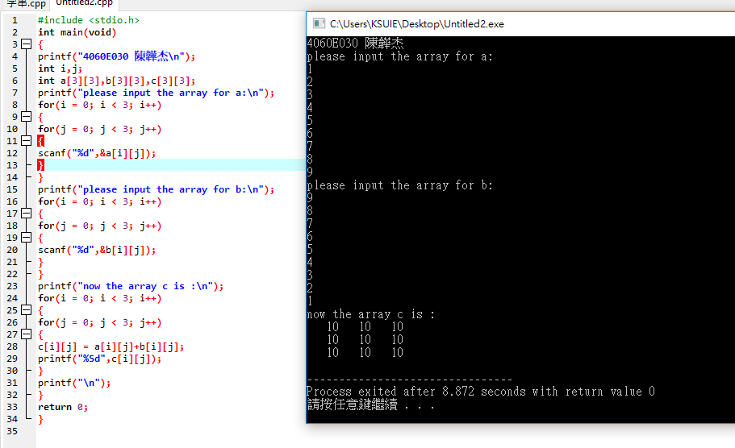
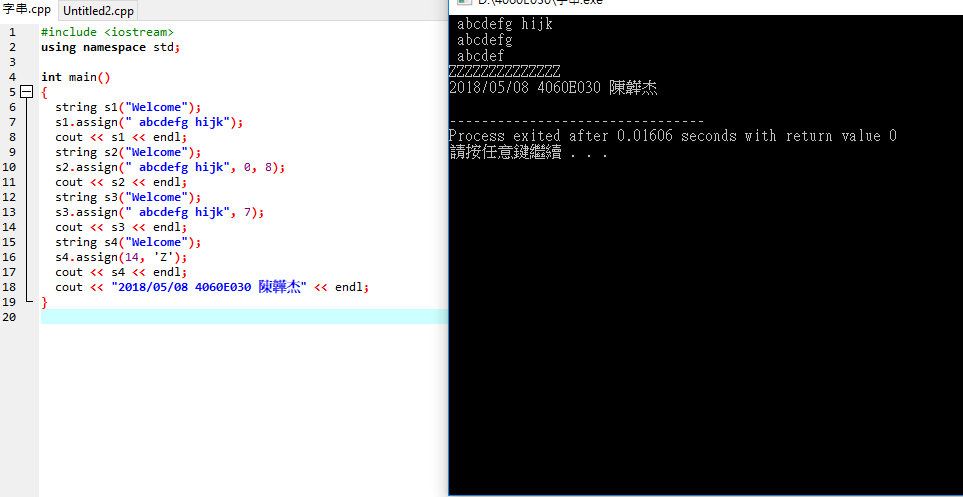
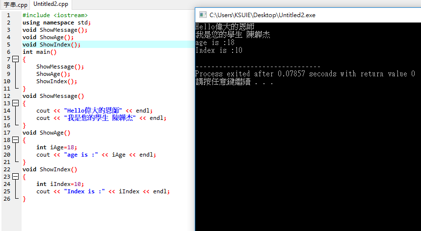
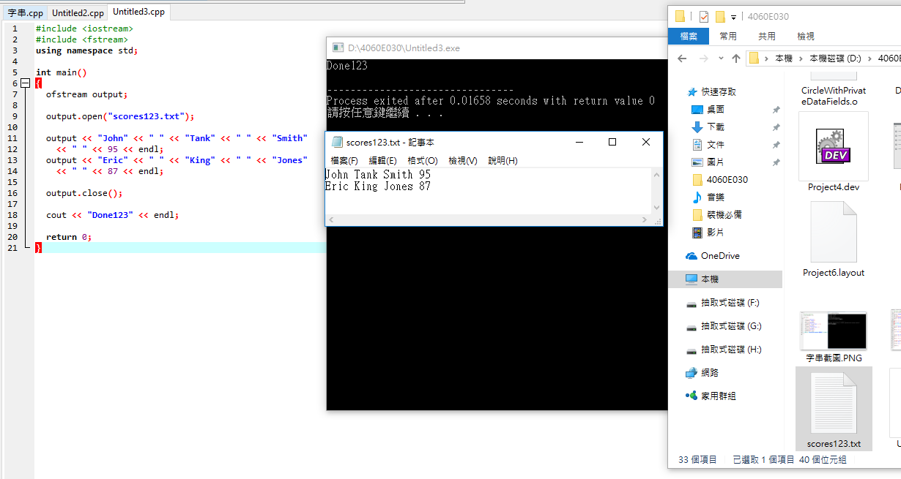
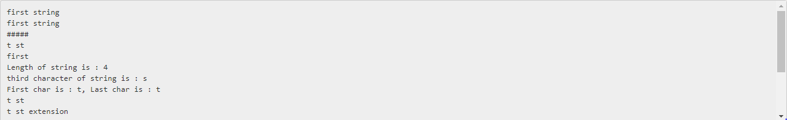
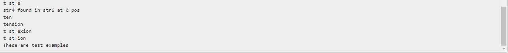
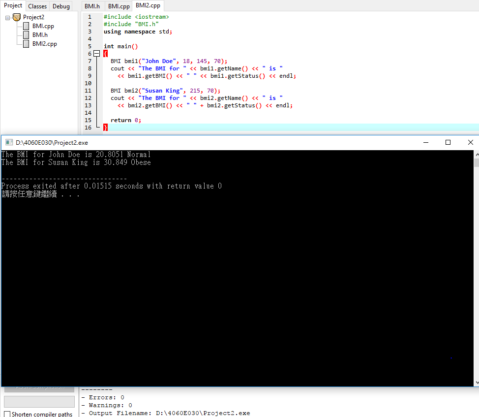

###### exercise1 矩陣相加

```
#include <stdio.h>
int main(void)
{
printf("4060E030 陳韡杰\n");
int i,j;
int a[3][3],b[3][3],c[3][3];
printf("please input the array for a:\n"); 
for(i = 0; i < 3; i++)
{
for(j = 0; j < 3; j++)
{
scanf("%d",&a[i][j]);
}
}
printf("please input the array for b:\n"); 
for(i = 0; i < 3; i++)
{
for(j = 0; j < 3; j++)
{
scanf("%d",&b[i][j]);
}
}
printf("now the array c is :\n");
for(i = 0; i < 3; i++)
{
for(j = 0; j < 3; j++)
{
c[i][j] = a[i][j]+b[i][j];
printf("%5d",c[i][j]);
}
printf("\n");
}
return 0;
}


```


###### exercise2 矩陣相乘

```
#include <stdio.h>
int main(void)
{
int i,j;
int a[3][3],b[3][3],c[3][3];
printf("please input the array for a:\n");
for(i = 0; i < 3; i++)
{
for(j = 0; j < 3; j++)
{
scanf("%d",&a[i][j]);
}
}
printf("please input the array for b:\n"); 
for(i = 0; i < 3; i++)
{
for(j = 0; j < 3; j++)
{
scanf("%d",&b[i][j]);
}
}
printf("now the array c is :\n"); 
for(i = 0; i < 3; i++)
{
for(j = 0; j < 3; j++)
{
c[i][j] = a[i][j]*b[i][j];
printf("%5d",c[i][j]);
}
printf("\n");
}
return 0;
}

```

###### exercise_array

```
#include <iostream>
using namespace std;
int main()
{
	cout << "2018.04.17" << endl;
	
	int i,a[10],b=1;

	for(i=0;i<10;i++)
	{
		a[i]=b;
		b++;
    }

	for(i=0;i<10;i++)
		cout << a[i] << endl;
		
    return 0;
}
```


###### exercise

```
[1]載入相關模組
[2]使用(標準)命名空間

[3]建立類別class
類別class包括
[3.1]屬性attribute:
[3.2]建構子(CONSTRUCTOR):兩個(含預設建構子DEFAULT)
[3.3]方法(METHOD/FUNCTION):

[4]main函式
[4.1]用類別class建立三個物件
[4.2]利用**物件.方法**及**物件.屬性**來執行運算


```

###### exercise string

```
#include <iostream>
#include <string>
using namespace std;
int main()
{

    string name;
    cout << "enter your name: ";
    getline(cin, name, '\n'); 
    name.append("4060E030");
    cout << "Your name is " << name << endl;
	
}

```


###### exercise

```
#include <iostream>
using namespace std;

int main()
{
  string s1("Welcome");
  s1.append(" to CPP"); 
  cout << s1 << endl; 
  string s2("Welcome");
  s2.append(" to C and Cpp", 3, 6); 
  cout << s2 << endl;
  string s3("Welcome");
  s3.append(" to C and Cpp", 7); 
  cout << s3 << endl; 
  string s4("Welcome"); 
  s4.append(14, 'Z'); 
  cout << s4 << endl; 
  cout << "2018/05/08 4060E030 陳韡杰" << endl; 
}
```


###### exercise 字串覆蓋

```
#include <iostream>
using namespace std;

int main()
{
  string s1("Welcome");
  s1.assign(" abcdefg hijk"); 
  cout << s1 << endl; 
  string s2("Welcome");
  s2.assign(" abcdefg hijk", 0, 8); 
  cout << s2 << endl;
  string s3("Welcome");
  s3.assign(" abcdefg hijk", 7); 
  cout << s3 << endl; 
  string s4("Welcome"); 
  s4.assign(14, 'Z'); 
  cout << s4 << endl; 
  cout << "2018/05/08 4060E030 陳韡杰" << endl; 
}

```

###### exercise

```
#include <iostream>
using namespace std;
void ShowMessage(); 
void ShowAge();
void ShowIndex(); 
int main()
{
	ShowMessage(); 
	ShowAge();
	ShowIndex(); 
}
void ShowMessage()
{
	cout << "Hello偉大的恩師" << endl;
	cout << "我是您的學生 陳韡杰" << endl;
}
void ShowAge()
{
	int iAge=18;
	cout << "age is :" << iAge << endl;
}
void ShowIndex()
{
	int iIndex=10;
	cout << "Index is :" << iIndex << endl;
}
```

###### exercise

```
#include <iostream>
#include <fstream>
using namespace std;

int main()
{
  ofstream output;

  output.open("scores123.txt");

  output << "John" << " " << "Tank" << " " << "Smith" 
    << " " << 95 << endl;
  output << "Eric" << " " << "King" << " " << "Jones" 
    << " " << 87 << endl;

  output.close();

  cout << "Done123" << endl;

  return 0;
}
```

###### exercise

```
// C++ program to demonstrate various function string class
#include <bits/stdc++.h> //使用標準c++標頭黨
using namespace std; //使用名稱空間

int main()
{
	// various constructor建構子 of string class 不同的建構子

	// initialization by raw string 宣告字串str1
	string str1("first string");

	// initialization by another string //使用字串物件
	string str2(str1);

	// initialization by character with number of occurence  宣告字串str3 產生5個#####
	string str3(5, '#');

	// initialization by part of another string  //使用字串物件 重第4個位置開始 印出4個字
	string str4(str1, 4, 4); // from 4 index (second parameter)
							// 4 characters (third parameter)

	// initialization by part of another string : iteartor version //使用字串物件 重同開始印出5個字
	string str5(str2.begin(), str2.begin() + 5);

	cout << str1 << endl; //會輸出 first string
	cout << str2 << endl; //會輸出 first string
	cout << str3 << endl; //會輸出 #####
	cout << str4 << endl; //會輸出 t st
	cout << str5 << endl; //會輸出 first

	// assignment operator ///
	string str6 = str4;

	// clear function deletes all character from string
	str4.clear();

	// both size() and length() return length of string and
	// they work as synonyms
	int len = str6.length(); // Same as "len = str6.size();"

	cout << "Length of string is : " << len << endl;

	// a particular character can be accessed using at /
	// [] operator
	char ch = str6.at(2); // Same as "ch = str6[2];"


	cout << "third character of string is : " << ch << endl;

	// front return first character and back returns last charcter
	// of string

	char ch_f = str6.front(); // Same as "ch_f = str6[0];"
	char ch_b = str6.back(); // Same as below
							// "ch_b = str6[str6.length() - 1];"

	cout << "First char is : " << ch_f << ", Last char is : "
		<< ch_b << endl;

	// c_str returns null terminated char array version of string
	const char* charstr = str6.c_str();
	printf("%s\n", charstr);

	// append add the argument string at the end
	str6.append(" extension");
	// same as str6 += " extension"

	// another version of appends, which appends part of other
	// string
	str4.append(str6, 0, 6); // at 0th position 6 character

	cout << str6 << endl;
	cout << str4 << endl;

	// find returns index where pattern is found.
	// If pattern is not there it returns predefined
	// constant npos whose value is -1

	if (str6.find(str4) != string::npos)
		cout << "str4 found in str6 at " << str6.find(str4)
			<< " pos" << endl;
	else
		cout << "str4 not found in str6" << endl;

	// substr(a, b) function returns a substring of b length
	// starting from index a
	cout << str6.substr(7, 3) << endl;

	// if second argument is not passed, string till end is
	// taken as substring
	cout << str6.substr(7) << endl;

	// erase(a, b) deletes b character at index a
	str6.erase(7, 4);
	cout << str6 << endl;

	// iterator version of erase
	str6.erase(str6.begin() + 5, str6.end() - 3);
	cout << str6 << endl;

	str6 = "This is a examples";

	// replace(a, b, str) replaces b character from a index by str
	str6.replace(2, 7, "ese are test");

	cout << str6 << endl;

	return 0;
}


```



###### exercise

```
[1]BMI類別的定義 ==> BMI.h
#ifndef BMI_H
#define BMI_H

#include <string>
using namespace std;

class BMI
{
public:
  BMI(const string& newName, int newAge, double newWeight, double newHeight);
  BMI(const string& newName, double newWeight, double newHeight);
  double getBMI() const;
  string getStatus() const;
  string getName() const;
  int getAge() const;
  double getWeight() const;
  double getHeight() const;

private:
  string name;
  int age;
  double weight;
  double height;
};

#endif

[2]BMI類別的實作 ==> BMI.cpp

#include <iostream>
#include "BMI.h"
using namespace std;

BMI::BMI(const string& newName, int newAge, 
  double newWeight, double newHeight)
{
  name = newName;
  age = newAge;
  weight = newWeight;
  height = newHeight;
}

BMI::BMI(const string& newName, double newWeight, double newHeight)
{
  name = newName;
  age = 20;
  weight = newWeight;
  height = newHeight;
}

double BMI::getBMI() const
{
  const double KILOGRAMS_PER_POUND = 0.45359237;
  const double METERS_PER_INCH = 0.0254;
  double bmi = weight * KILOGRAMS_PER_POUND /
    ((height * METERS_PER_INCH) * (height * METERS_PER_INCH));
  return bmi;
}

string BMI::getStatus() const
{
  double bmi = getBMI();
  if (bmi < 18.5)
    return "Underweight";
  else if (bmi < 25)
    return "Normal";
  else if (bmi < 30)
    return "Overweight";
    else
    return "Obese";
}

string BMI::getName() const
{
  return name;
}

int BMI::getAge() const
{
  return age;
}

double BMI::getWeight() const
{
  return weight;
}

double BMI::getHeight() const
{
  return height;
}
[3]使用BMI類別==> BMI.cpp

#include <iostream>
#include "BMI.h"
using namespace std;

int main()
{
  BMI bmi1("John Doe", 18, 145, 70);
  cout << "The BMI for " << bmi1.getName() << " is "
    << bmi1.getBMI() << " " << bmi1.getStatus() << endl;

  BMI bmi2("Susan King", 215, 70);
  cout << "The BMI for " << bmi2.getName() << " is "
    << bmi2.getBMI() << " " + bmi2.getStatus() << endl;

  return 0;
}
```

http://depart.femh.org.tw/dietary/3opd/bmi.htm

###### exercise

```
#ifndef STACK_H
#define STACK_H

class StackOfIntegers  //類別名稱
{
public:  //公開的::可以被存取
  StackOfIntegers();  //建構子
  bool isEmpty() const;  //()測試是否為空的函數
  int peek() const;    //最上層的函數
  void push(int value);   //把資料丟入的函數
  int pop();   //取出最上層的函數
  int getSize() const;  //取出堆疊大小的函數

private:    //1.打把資料隱藏起來  2.使用上述公開函數來存取
  int elements[100];  //整數類型的元素 大小為100
  int size;          //整數類型的大小
};


#include "StackOfIntegers.h"

StackOfIntegers::StackOfIntegers() //類別的建構子的實作
{ 
  size = 0;  //閃生大小為0的StackIntegers物件
}

bool StackOfIntegers::isEmpty() const //測試是否為空的實作
{  //此函數執行後回傳的值為布林，真或假
return (size == 0);   //()判斷size == 0 諾大小為0回傳假 ; 諾大小不為0回傳真
}

int StackOfIntegers::peek() const  //最上層的函數
{
  return elements[size - 1];  //回傳 size-1 位子的函數
}

void StackOfIntegers::push(int value)  //把資料丟入的函數
{
  elements[size++] = value;   //先把資料丟入size後 在執行size++  
}
 
int StackOfIntegers::pop() //取出最上層的函數
{
  return elements[--size]; //先執行size--後 再取出size位子的函數
}

int StackOfIntegers::getSize() const //取出堆疊大小的函數
{
  return size;  //取出size的值
}


```

###### exercise

```
[3]使用==>TestStackOfIntegers.cpp

#include <iostream>
#include "StackOfIntegers.h"
using namespace std;

int main()
{
  StackOfIntegers stack;

  for (int i = 0; i < 10; i++)
    stack.push(i);

  while (!stack.isEmpty())
    cout << stack.pop() << " ";

  return 0;
}
```

###### exercise

```

```

###### exercise

```

```

###### exercise

```

```

###### exercise

```

```

