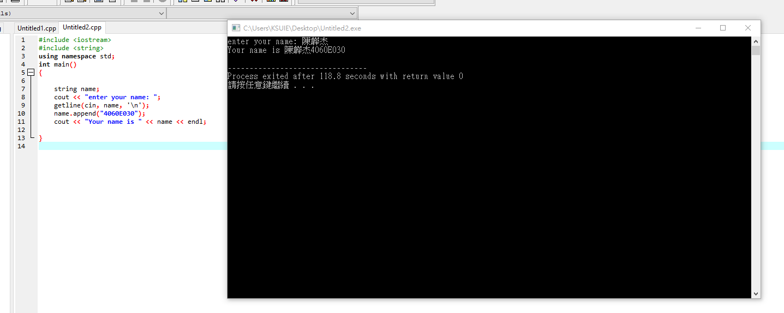

###### exercise1 矩陣相加

```
#include <stdio.h>
int main(void)
{
int i,j;
int a[3][3],b[3][3],c[3][3];
printf("please input the array for a:\n"); 
for(i = 0; i < 3; i++)
{
for(j = 0; j < 3; j++)
{
scanf("%d",&a[i][j]);
}
}
printf("please input the array for b:\n"); 
for(i = 0; i < 3; i++)
{
for(j = 0; j < 3; j++)
{
scanf("%d",&b[i][j]);
}
}
printf("now the array c is :\n");
for(i = 0; i < 3; i++)
{
for(j = 0; j < 3; j++)
{
c[i][j] = a[i][j]+b[i][j];
printf("%5d",c[i][j]);
}
printf("\n");
}
return 0;
}

```

###### exercise2 矩陣相乘

```
#include <stdio.h>
int main(void)
{
int i,j;
int a[3][3],b[3][3],c[3][3];
printf("please input the array for a:\n");
for(i = 0; i < 3; i++)
{
for(j = 0; j < 3; j++)
{
scanf("%d",&a[i][j]);
}
}
printf("please input the array for b:\n"); 
for(i = 0; i < 3; i++)
{
for(j = 0; j < 3; j++)
{
scanf("%d",&b[i][j]);
}
}
printf("now the array c is :\n"); 
for(i = 0; i < 3; i++)
{
for(j = 0; j < 3; j++)
{
c[i][j] = a[i][j]*b[i][j];
printf("%5d",c[i][j]);
}
printf("\n");
}
return 0;
}

```

###### exercise_array

```
#include <iostream>
using namespace std;
int main()
{
	cout << "2018.04.17" << endl;
	
	int i,a[10],b=1;

	for(i=0;i<10;i++)
	{
		a[i]=b;
		b++;
    }

	for(i=0;i<10;i++)
		cout << a[i] << endl;
		
    return 0;
}
```


###### exercise

```
[1]載入相關模組
[2]使用(標準)命名空間

[3]建立類別class
類別class包括
[3.1]屬性attribute:
[3.2]建構子(CONSTRUCTOR):兩個(含預設建構子DEFAULT)
[3.3]方法(METHOD/FUNCTION):

[4]main函式
[4.1]用類別class建立三個物件
[4.2]利用**物件.方法**及**物件.屬性**來執行運算


```

###### exercise string

```
#include <iostream>
#include <string>
using namespace std;
int main()
{

    string name;
    cout << "enter your name: ";
    getline(cin, name, '\n'); 
    name.append("4060E030");
    cout << "Your name is " << name << endl;
	
}

```


###### exercise

```
#include <iostream>
using namespace std;

int main()
{
  string s1("Welcome");
  s1.append(" to CPP"); 
  cout << s1 << endl; 
  string s2("Welcome");
  s2.append(" to C and Cpp", 3, 6); 
  cout << s2 << endl;
  string s3("Welcome");
  s3.append(" to C and Cpp", 7); 
  cout << s3 << endl; 
  string s4("Welcome"); 
  s4.append(14, 'Z'); 
  cout << s4 << endl; 
  cout << "2018/05/08 4060E030 陳韡杰" << endl; 
}
```


###### exercise

```

```

###### exercise

```

```

###### exercise

```

```

###### exercise

```

```

###### exercise

```

```

###### exercise

```

```

###### exercise

```

```

###### exercise

```

```

###### exercise

```

```

###### exercise

```

```

###### exercise

```

```

